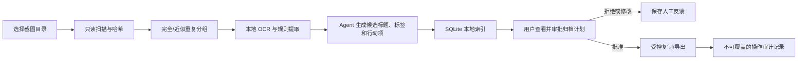
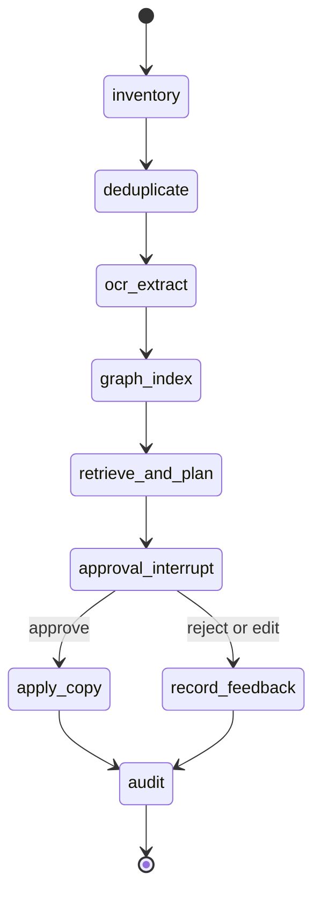

# 本地截图行动归档 Agent：详细开发设计文档

> 项目代号：`local-screenshot-action-archive-agent`  
> 文档状态：设计阶段；尚未实现、测试或部署。  
> 最后更新：2026-08-01  
> 文档编码：UTF-8

## 1. 项目定义

本项目是一个默认离线运行的桌面文件整理 Agent。它扫描用户主动选择的截图目录，通过图像去重、OCR、可选的本地视觉语言模型和规则提取，将截图整理为“可检索信息”和“待用户确认的行动建议”。Agent 采用 LangGraph 编排；Neo4j 仅保存截图、提取实体、行动项和归档建议之间的关系，用于本地 GraphRAG 检索。

它不自动删除图片、不自动移动原文件、不把截图上传到云端，也不把从图片中抽取的地址、订单号、验证码或聊天内容视作可公开数据。

### 1.1 要解决的问题

截图往往同时包含待办事项、收件地址、支付凭证、课程通知、网页资料和无价值临时图。按文件名或时间浏览难以找回关键信息，更不适合直接把整个截图目录交给云端服务。

项目将“看图整理”拆分为可审计的步骤：

1. 建立本地只读索引；
2. 找出完全重复和近似重复图片；
3. OCR/视觉理解形成候选标题、标签、行动项；
4. 对敏感内容和低置信度结论显式标记；
5. 生成仅供用户审批的归档计划；
6. 只有用户逐项确认后才执行复制、移动或导出操作。

### 1.2 Agent 的边界

Agent 不是“把图片喂给大模型后返回标签”的聊天壳。它通过工具编排完成目录扫描、图像哈希、OCR、索引检索、候选计划生成和审批后的受控文件操作，并保留每个结论的来源与置信度。

Agent 不能：

- 越过用户选择的目录访问任意文件；
- 在没有显式审批的情况下移动、删除或覆盖文件；
- 将原始截图、OCR 文本或密钥发送给外部 API；
- 把 OCR 推断结果视为事实或自动执行支付、提醒、发信等外部行为。

## 2. MVP 范围与非目标

### 2.1 MVP 范围

- 支持用户选择一个本地图片目录；仅扫描 `.png`、`.jpg`、`.jpeg`、`.webp`。
- 计算 SHA-256 和感知哈希，识别完全重复及近似重复候选组。
- 对图片做本地 OCR，保存文本、OCR 语言和引擎版本。
- 使用规则提取日期、链接、金额模式和行动词；本地模型可选生成简短标题/类别建议。
- 建立 SQLite 本地索引，并将可解释关系写入本地 Neo4j，支持关键词、日期、标签、行动状态和关系路径检索。
- 生成归档建议：保留、标记为待处理、归入建议分类、合并重复组。
- 提供人工审批页；MVP 的审批后操作只允许“复制到用户指定目录”和“写入本地 JSON/Markdown 清单”。

### 2.2 明确不做

- 不做云同步、账号系统、多人协作、手机端同步或浏览器扩展。
- 不做自动删除、覆盖重命名、系统级垃圾清理或回收站清空。
- 不做 OCR 结果的真实性担保；不提取或自动使用验证码、银行卡号、密码。
- 不做任意格式文档解析；PDF、视频、聊天数据库和压缩包留给后续版本。
- 不把“归档建议已生成”表述为“用户文件已整理”。

### 2.3 完成定义

MVP 完成需要满足以下可验证条件：

| 编号 | 验收项 | 通过证据 |
| --- | --- | --- |
| AC-01 | 用户可选择一个目录并完成只读扫描 | 索引任务记录、文件数量、错误列表 |
| AC-02 | 完全重复图片被正确聚合 | 固定测试样本与哈希结果 |
| AC-03 | 近似重复仅作为候选，不自动合并 | 相似度、缩略图与人工确认记录 |
| AC-04 | OCR 文本和图片来源可追溯 | 图片 ID、OCR 引擎版本、文本片段 |
| AC-05 | 归档计划在审批前不改变原文件 | 文件操作审计日志为空 |
| AC-06 | 审批后只在目标目录生成副本 | 原文件哈希不变、目标副本哈希一致 |
| AC-07 | 本地数据库和公开示例不含真实私密截图 | 脱敏示例集、敏感信息检查记录 |

## 3. 用户流程



### 3.1 典型使用场景

1. 用户选中某个月的截图目录。
2. 系统报告“发现 245 张图片、18 组完全重复、7 组近似重复候选、31 条待确认行动项”。
3. 用户搜索“快递”或“8 月 12 日”，查看对应截图与 OCR 证据。
4. 用户勾选“复制到 `待处理/订单`”的建议，而非让系统自由移动原图。
5. 系统复制文件并生成含原始路径、目标路径、时间和 SHA-256 的审计记录。

## 4. 技术架构

### 4.1 模块边界

| 模块 | 职责 | 不负责 |
| --- | --- | --- |
| `scanner` | 枚举白名单后缀、读取元数据、建立文件清单 | 解析任意用户目录外的文件 |
| `image_fingerprint` | SHA-256、dHash/pHash、缩略图 | 决定删除或合并图片 |
| `ocr_service` | 本地 OCR 与版面基础信息 | 对文字真实性作担保 |
| `extractor` | 规则提取日期、链接、金额、行动词 | 自动执行行动 |
| `agent_orchestrator` | 组合工具输出，生成带证据的候选计划 | 绕过审批执行文件操作 |
| `index_store` | SQLite、FTS 搜索、任务与审计记录 | 上传、同步到第三方 |
| `graph_store` | Neo4j 图关系、GraphRAG 关系检索 | 作为原始图片或凭据的唯一存储 |
| `approval_service` | 展示、修改、批准/拒绝计划 | 后台自动批准 |
| `file_operator` | 仅按批准计划复制或导出 | 删除、覆盖、跨边界写入 |

### 4.2 推荐技术栈

- Python 3.11+、FastAPI、Pydantic、SQLite（FTS5）。
- LangGraph：以状态图组织扫描、OCR、检索、计划和审批中断；开发期使用 SQLite checkpoint，生产化前不宣称具备多用户持久化能力。
- Neo4j Community 本地实例：保存实体关系和可选向量索引；SQLite 仍是文件操作、审计和全文索引的事实来源。
- `neo4j-graphrag`：用于将语义检索结果与图关系扩展结合；仅在图数据实际完成导入后启用。
- Pillow/OpenCV：读取图片、生成缩略图、计算哈希。
- PaddleOCR 或 Tesseract：本地 OCR；最终选型以本机可稳定安装的版本为准。
- 可选 Ollama + Qwen2.5-VL：只在用户明确开启时对低风险缩略图生成摘要；没有本地模型时，规则和 OCR 流程仍可运行。
- 前端 MVP 使用 Jinja2/HTMX 或 Streamlit 二选一；优先 FastAPI + Jinja2/HTMX，减少前后端分离复杂度。

不需要付费 API。任何可选模型请求都必须有“仅本地模型”状态标识。

## 5. 本地数据与隐私设计

### 5.1 存储位置

每个扫描工作区都有一个用户可见根目录，例如：

```text
workspace/
  screenshot-index.db
  thumbnails/
  exports/
  audit/
  config.json
```

原始截图始终留在用户所选目录；索引仅保存路径、哈希、受控尺寸缩略图、OCR/提取结果和审计记录。缩略图仍可能包含隐私内容，因此默认不进入 Git、不作为公开演示素材。

### 5.2 敏感字段策略

| 类型 | 处理方式 |
| --- | --- |
| 验证码/一次性口令 | 不提取为行动项；展示时局部掩码 |
| 长数字串/银行卡疑似文本 | 标记 `sensitive_candidate`，默认部分掩码 |
| 地址/电话/姓名 | 可检索但默认不出现在导出摘要；公开导出时必须脱敏 |
| URL | 保存原始文本，但不自动访问链接 |
| 模型摘要 | 不可替代 OCR 原文；记录模型版本和是否启用 |

MVP 不宣称提供密码学级别的数据加密。若用户设备有磁盘加密，项目可以依赖操作系统保护；应用层加密属于后续增强。

## 6. 数据模型

### 6.1 核心表

| 表 | 关键字段 | 说明 |
| --- | --- | --- |
| `scan_run` | `id`、`root_path`、`started_at`、`status` | 一次只读扫描任务 |
| `asset` | `id`、`path`、`sha256`、`phash`、`size`、`mtime` | 一张原始图片的索引 |
| `duplicate_group` | `id`、`kind`、`representative_asset_id` | `exact` 或 `near` 重复组 |
| `ocr_result` | `asset_id`、`engine`、`language`、`text`、`confidence` | OCR 产物 |
| `extraction` | `asset_id`、`kind`、`value_masked`、`evidence_span`、`confidence` | 日期、链接、行动候选等 |
| `archive_proposal` | `id`、`asset_id`、`action`、`target`、`rationale`、`status` | 待审批建议 |
| `audit_event` | `id`、`proposal_id`、`event_type`、`before_hash`、`after_hash` | 只追加的文件操作证据 |

### 6.2 GraphRAG 图模型

Neo4j 不用于制造“知识图谱”卖点，而是回答 SQLite 单表检索难以表达的本地关系问题，例如“与某个日期和订单实体相连的所有截图及待处理事项”。图模型固定为：

```text
(:Asset)-[:HAS_OCR]->(:OcrChunk)
(:Asset)-[:DUPLICATE_OF {kind, distance}]->(:Asset)
(:Asset)-[:MENTIONS {confidence, evidence_span}]->(:Entity)
(:Asset)-[:SUGGESTED_ACTION]->(:ActionItem)
(:ActionItem)-[:PROPOSES]->(:ArchiveProposal)
(:ArchiveProposal)-[:IN_CATEGORY]->(:Category)
```

- `Entity` 初期仅允许 `date`、`url`、`amount_candidate`、`order_candidate`、`action_phrase` 五类受控标签。
- 每条 `MENTIONS` 关系保留 `asset_id` 与 OCR 证据片段；模型生成的实体必须标记来源为 `model_suggestion`。
- GraphRAG 查询采用“向量/全文候选 → 一跳或两跳受控关系扩展 → 返回来源图片和证据”的模式，不允许模型自由生成 Cypher 写操作。

### 6.3 Agent 输出契约

```json
{
  "proposal_id": "prop_001",
  "asset_id": "asset_034",
  "action": "copy_to_category",
  "suggested_category": "订单与售后",
  "confidence": 0.73,
  "rationale": "OCR 中出现订单号模式和“待收货”文本。",
  "evidence": {
    "ocr_result_id": "ocr_034",
    "text_span": "订单已发货，预计 8 月 5 日送达"
  },
  "requires_approval": true
}
```

`confidence` 仅表示该规则或模型对分类建议的内部评分，不代表 OCR 事实准确率；低置信度建议默认进入“待人工判断”，不进入可批量批准列表。

## 7. Agent 工作流

### 7.1 LangGraph 状态图



LangGraph state 包含 `workspace_id`、`asset_ids`、`evidence_refs`、`proposal_ids`、`approval_decision` 与 `audit_refs`。`apply_copy` 是唯一具有文件写权限的节点，并通过 LangGraph interrupt 暂停，等待网页中的用户批准、修改或拒绝。每一步 checkpoint 必须关联本地任务 ID，便于恢复和复核。

### 7.2 工具清单

| 工具 | 输入 | 输出 | 权限 |
| --- | --- | --- | --- |
| `list_assets` | 已授权目录 | 白名单图片清单 | 只读 |
| `fingerprint_image` | 单张图片路径 | 哈希、尺寸、缩略图 | 只读 |
| `run_local_ocr` | 单张图片 | OCR 文本与置信度 | 只读 |
| `search_index` | 查询条件 | 本地索引结果 | 只读 |
| `build_proposals` | 规则/模型结果 | 候选归档计划 | 写入数据库，不改图片 |
| `apply_approved_copy` | 已批准 proposal ID | 新副本、审计事件 | 受控写入 |

### 7.3 编排规则

1. 扫描阶段先做确定性哈希和 OCR，不先调用模型。
2. Agent 的检索节点先从 SQLite FTS 获得候选，再使用 Neo4j 扩展重复、实体、行动和建议之间的有限关系；每条计划必须带 `asset_id` 和原始证据。
3. 当 OCR 置信度低、规则冲突或敏感候选存在时，Agent 输出“需要人工确认”，不得猜测补全。
4. 任何文件写入必须引用已批准的 `proposal_id`，且目标路径必须位于工作区配置的允许目录下。
5. 复制完成后重新计算副本哈希；不一致则记录失败并保留原文件。

## 8. Web 页面与 API

### 8.1 页面

| 页面 | 路径 | 核心内容 |
| --- | --- | --- |
| 工作区 | `/` | 选择目录、创建扫描任务、隐私提示 |
| 扫描结果 | `/runs/{id}` | 文件数、错误、重复组、OCR 状态 |
| 搜索 | `/search` | 关键词/日期/标签查询与图片预览 |
| 行动项 | `/actions` | OCR 证据、日期候选、待办状态 |
| 归档审批 | `/proposals` | 单项确认、修改目标、拒绝理由 |
| 审计日志 | `/audit` | 已批准复制/导出操作及哈希 |

### 8.2 API 草案

| 方法 | 路径 | 行为 |
| --- | --- | --- |
| `POST` | `/api/v1/workspaces` | 创建本地工作区配置 |
| `POST` | `/api/v1/scans` | 提交目录扫描任务 |
| `GET` | `/api/v1/scans/{id}` | 查询进度与错误 |
| `GET` | `/api/v1/assets` | 受条件过滤的索引查询 |
| `POST` | `/api/v1/proposals/generate` | 基于既有索引生成建议 |
| `POST` | `/api/v1/proposals/{id}/approve` | 明确批准单项建议 |
| `POST` | `/api/v1/proposals/{id}/reject` | 拒绝并记录原因 |
| `POST` | `/api/v1/proposals/{id}/apply` | 仅执行已批准复制操作 |

MVP 的 `apply` 端点不提供删除、覆盖、任意 Shell 命令或任意路径写入能力。

## 9. 重复检测与提取规则

### 9.1 重复分级

- 完全重复：SHA-256 相同，系统可安全标记为同一文件内容，但不自动删除。
- 近似重复：pHash/dHash 距离满足配置阈值；仅作为候选组，需要缩略图人工确认。
- 语义相近：同一页面不同滚动位置、相似聊天截图等；MVP 不声称自动识别，只可由后续视觉模型扩展。

### 9.2 行动项规则

初版只识别低风险候选：日期/时间 + 行动词组合，例如“截止”“领取”“预约”“待处理”。提取结果必须保留 OCR 原文片段，且绝不自动创建日历事件或提醒。

## 10. 测试策略

### 10.1 测试数据

仓库中只使用自制、开源或完全脱敏的截图样例；不上传用户真实截图、聊天记录、订单、地址或验证码。测试样例覆盖：

- 完全相同文件；
- 相同内容不同压缩；
- 相似但不应合并的图片；
- 中英文 OCR；
- 低清晰度/空白图；
- 含日期行动词的模拟通知；
- 含疑似敏感数字的模拟图片。

### 10.2 关键测试

| 编号 | 场景 | 断言 |
| --- | --- | --- |
| TC-01 | 扫描白名单图片 | 非图片不被索引 |
| TC-02 | 相同字节文件 | 被归入同一 exact 组 |
| TC-03 | 近似图片 | 进入候选组，不生成删除操作 |
| TC-04 | OCR 故障 | 图片保留索引，状态为可追踪失败 |
| TC-05 | 敏感候选 | 导出内容被掩码，且不产生自动操作 |
| TC-06 | 未批准 proposal | 调用 apply 被拒绝 |
| TC-07 | 已批准复制 | 原文件哈希不变，副本哈希匹配 |
| TC-08 | 目标路径越界 | 操作被拒绝并写审计错误 |

## 11. 工程结构

```text
local-screenshot-action-archive-agent/
  README.md
  .gitignore
  docs/
    详细开发设计文档.md
    隐私与数据边界.md
    测试记录模板.md
  app/
    api/
    services/
    agent/
    storage/
    templates/
  tests/
    fixtures/                 # 仅脱敏图片
    unit/
    integration/
  artifacts/
    .gitkeep
```

`.gitignore` 必须排除真实工作区、SQLite 索引、缩略图、导出文件、日志、模型缓存和任何本地配置中的路径信息。

## 12. 分阶段计划

1. **阶段 0：安全骨架**：工作区白名单、数据库迁移、`.gitignore`、脱敏测试样例。
2. **阶段 1：只读索引**：扫描、SHA-256、pHash、SQLite、重复组页面。
3. **阶段 2：本地 OCR 与搜索**：OCR 任务、FTS、敏感掩码、错误记录。
4. **阶段 3：LangGraph + GraphRAG 候选计划**：写入受控 Neo4j 图、规则优先检索、可选本地模型、证据链、审批中断状态机。
5. **阶段 4：受控复制与展示**：批准后复制、审计日志、README、演示录屏。

## 13. 已知限制与公开展示边界

- OCR 与视觉模型可能误读、漏读或误分类，不能作为事实或自动决策依据。
- 近似重复不等于可以删除；MVP 不提供删除功能。
- 公开展示只能用脱敏样例，不能使用个人截图原图或未处理 OCR 文本。
- “全本地运行”需要在实现阶段用网络监控、依赖清单和运行日志验证；设计文档本身不构成该结论。
- Neo4j 图中的实体/关系由规则或模型提取，仍可能错误；图路径只能辅助检索，不能被解释为真实世界事实。
- 后续简历描述只可基于真实实现、测试报告、运行截图和可复现演示重新生成。
